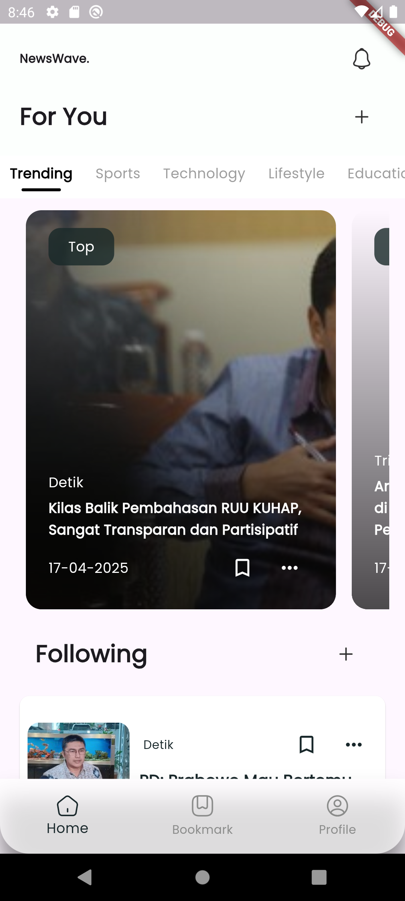
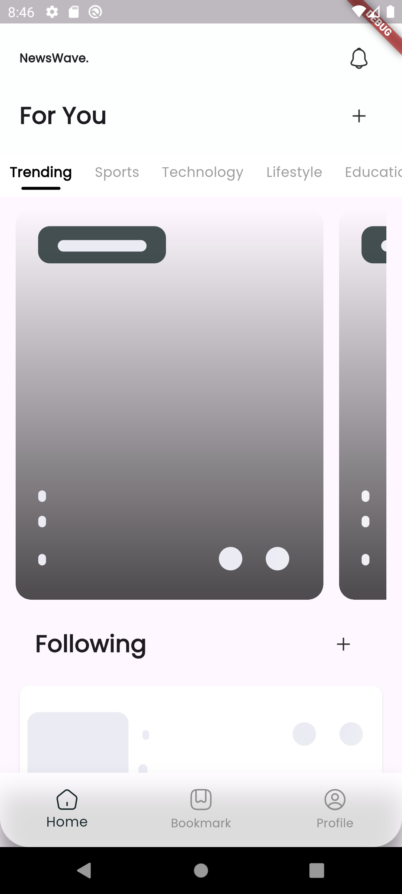
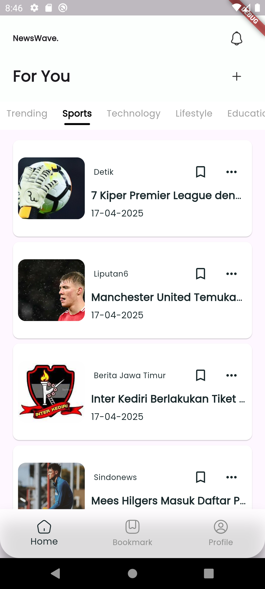

# 🌊 NewsWave

Welcome to **NewsWave** — your go-to mobile app for exploring the latest and most relevant news from around the world! 🌍🗞️

  

## ✨ Features

✅ Clean and modern UI with smooth experience  
✅ Browse curated news articles  
✅ Filter by category and source  
✅ Responsive design — fits all screen sizes  
✅ Built with [Flutter](https://flutter.dev/) 🚀  

> *NewsWave is designed to bring clarity to clutter — giving users a seamless and elegant way to stay updated.*

---

## 📱 Screenshots

| Home | Loading | Tab |
|------|--------|--------|
|  |  | 

---

## 🛠️ Tech Stack

- ⚙️ **Flutter 3.22**
- 🧠 **BLoC Pattern** for state management
- 🌐 **REST API** integration for fetching news
- ✨ Custom components and styling with love ❤️

---

## 📦 Dependencies

Here are the main packages powering this app:

| Package | Description |
|--------|-------------|
| [`google_fonts`](https://pub.dev/packages/google_fonts) | Use Google Fonts in your Flutter app |
| [`iconsax`](https://pub.dev/packages/iconsax) | Modern icon pack with minimal style |
| [`uuid`](https://pub.dev/packages/uuid) | Generate unique IDs (for article storage, etc.) |
| [`dartz`](https://pub.dev/packages/dartz) | Functional programming helpers (Either, Option, etc.) |
| [`equatable`](https://pub.dev/packages/equatable) | Simplifies equality comparison in Dart classes |
| [`dio`](https://pub.dev/packages/dio) | Powerful HTTP client |
| [`json_annotation`](https://pub.dev/packages/json_annotation) | Annotation-based JSON serialization |
| [`flutter_bloc`](https://pub.dev/packages/flutter_bloc) | BLoC state management |
| [`bloc`](https://pub.dev/packages/bloc) | Core BLoC utilities |
| [`flutter_dotenv`](https://pub.dev/packages/flutter_dotenv) | Load environment variables from `.env` |
| [`provider`](https://pub.dev/packages/provider) | Dependency injection and state management |
| [`get_it`](https://pub.dev/packages/get_it) | Service locator (DI) |
| [`intl`](https://pub.dev/packages/intl) | Date, time, and number formatting |
| [`skeletonizer`](https://pub.dev/packages/skeletonizer) | Beautiful loading skeletons |
| [`flutter_svg`](https://pub.dev/packages/flutter_svg) | SVG rendering for Flutter |
| [`webview_flutter`](https://pub.dev/packages/webview_flutter) | WebView integration |
| [`url_launcher`](https://pub.dev/packages/url_launcher) | Open URLs in browser or apps |
| [`sqflite`](https://pub.dev/packages/sqflite) | SQLite plugin for Flutter |

---

📚 References

📰 News API: [newsdata.io](https://newsdata.io/)

🎨 UI Design: This app's design is inspired by Mumtaz Aaliyah Fasya - [NewsWave Design](https://www.linkedin.com/posts/mumtaz-aaliyah-fasya_design-ui-uiux-activity-7231264963829321728-aXAI?utm_source=share&utm_medium=member_desktop&rcm=ACoAADPQUowBAlWgMR2UXNoo8wmJx1eiANZQhXY)

---

🧑‍💻 Author
Made with 💙 by uzifauzi
